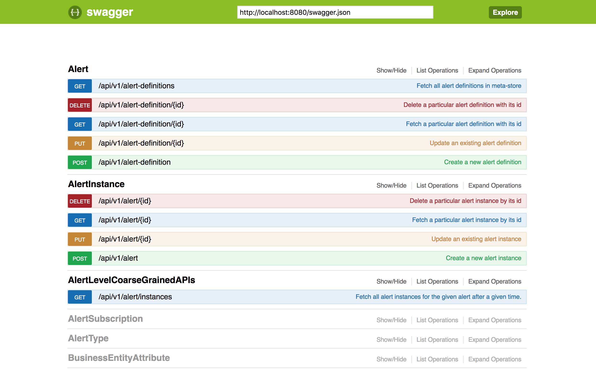

# Java-DropWizard-WebService
This repository contains the code for one of the java dropwizard web-service that I developed as part of my day job. 
This micro-service was built as the metadata repository of a near real-time anomaly detection platform. 
Keeping the final version of the service here for reference.

## Requirements and Goals of the System
 Our meta-store service should meet the following requirements
 
 **Functional Requirements:**
 1. Given meta-store service, other micro-services in our anomaly detection platform should be able to interact with
 meta-store databse via REST interface.
 
 2. In meta-store service, there should be separate and relevant REST APIs to perform CRUD operations on all meta-store
 tables.
 
 3. The meta-store service should be able to sync and update relevant data with search database in elastic search.
 
 
 
 **Non-Functional Requirements:**
 1. The meta-store service should be highly available to all the other micro-services in the system. This is important 
 because if meta-store service fails, none of the other services can talk to the meta-store db thus failing the seamless 
 operations of our anomaly platform.
 
 2. The meta-store service should ensure data consistency at all point of time.
 
 3. The micro-service should be containerized while deployment.
 
 **Extended Requirements:**
 1. Analytics; e.g. add system metrics to instrument performance of each of the APIs exposed.
 
 ## System APIs
 
 
 
 ## Database Design
 
 
 
 ## Set-up and Deployment
 * Make sure that you have JDK 8 and maven 3 installed and configured in your system.
 * Build the project using 
 ```
 $ cd <project home directory, where you find pom.xml>
 $ mvn clean install
 ```
 * Once you build the fat jar, run the jar using 
 ```
 $ java -jar <javr file> server <path to dev.yml>
 ``` 
 * For dockerization, make sure that you have docker service installed and running in your system.
 ```
 $ cd <application home directory, where you find Dockerfile>
 $ docker image build -t metasore:1.0 .
 $ docker container run --publish 8000:8080 --detach --name ms metasore:1.0
 ```